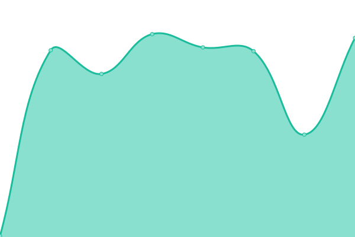

# [📈 Live Status](https://demo.upptime.js.org): <!--live status--> **🟧 Partial outage**

This repository contains the open-source uptime monitor and status page for [CodeMiners](https://www.codeminer.co), powered by [Upptime](https://github.com/upptime/upptime).

With [Upptime](https://upptime.js.org), you can get your own unlimited and free uptime monitor and status page, powered entirely by a GitHub repository. We use [Issues](https://github.com/codeminer-co/upptime/issues) as incident reports, [Actions](https://github.com/codeminer-co/upptime/actions) as uptime monitors, and [Pages](https://demo.upptime.js.org) for the status page.

<!--start: status pages-->
<!-- This summary is generated by Upptime (https://github.com/upptime/upptime) -->
<!-- Do not edit this manually, your changes will be overwritten -->
<!-- prettier-ignore -->
| URL | Status | History | Response Time | Uptime |
| --- | ------ | ------- | ------------- | ------ |
|  [Ghoomo Phiroo API](https://stg-api.ghoomophiroo.com/status) | 🟩 Up | [ghoomo-phiroo-api.yml](https://github.com/codeminer-co/upptime/commits/HEAD/history/ghoomo-phiroo-api.yml) | 

 344ms
     
 | 

<a href="https://uptime.codeminer.co/history/ghoomo-phiroo-api">100.00%</a>
    

|  [Prophecy API](http://prophecy.codeminer.co:3004/status) | 🟩 Up | [prophecy-api.yml](https://github.com/codeminer-co/upptime/commits/HEAD/history/prophecy-api.yml) | 

 170ms
     
 | 

<a href="https://uptime.codeminer.co/history/prophecy-api">100.00%</a>
    

|  [Human Currency API](http://humancurrency.org:3000/status) | 🟥 Down | [human-currency-api.yml](https://github.com/codeminer-co/upptime/commits/HEAD/history/human-currency-api.yml) | 

 0ms
     
 | 

<a href="https://uptime.codeminer.co/history/human-currency-api">0.00%</a>
    

<!--end: status pages-->

[**Visit our status website →**](https://uptime.codeminer.co)

## 📄 License

- Powered by: [Upptime](https://github.com/upptime/upptime)
- Code: [MIT](./LICENSE) © [Anand Chowdhary](https://anandchowdhary.com), supported by [Pabio](https://pabio.com)
- Data in the `./history` directory: [Open Database License](https://opendatacommons.org/licenses/odbl/1-0/)
